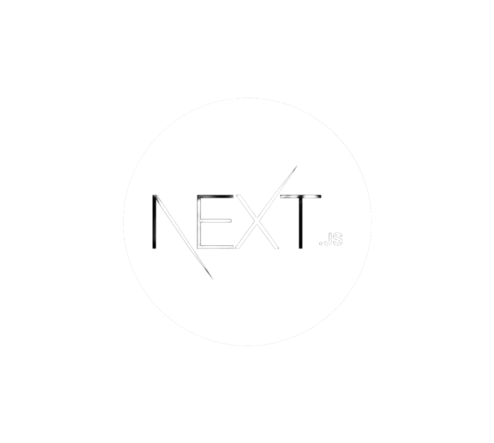

## 🔥 Streak Contribution

<!-- ## 🏆 Trophy GitHub

 -->

## 🏆 Stats

## 🔧 Skill

- C/C++, Assembly, Python, Rust, Javascript, Typescript, Golang, Gin, HTML, CSS, MERN Stack, NodeJs, ExpressJs, Git, REST API
- Develop Windows Apps, Windows Kernel Driver, Web Development, Machine Learning
- ReactJs, NextJs, Redux, React Router, React Query, Tailwind, Bootstrap
- ImGui
- PostgreSQL, MongoDB, MySQL
- Docker, Kubernetes
- Familiar with Windows, Linux operating systems
- IDA Pro, Ghidra, Reclass.Net

## 💻 My Tech Stack

  
  
  
  
  
  
  
  
  
  
  
  
  
  
  
  
  
  
  
  

